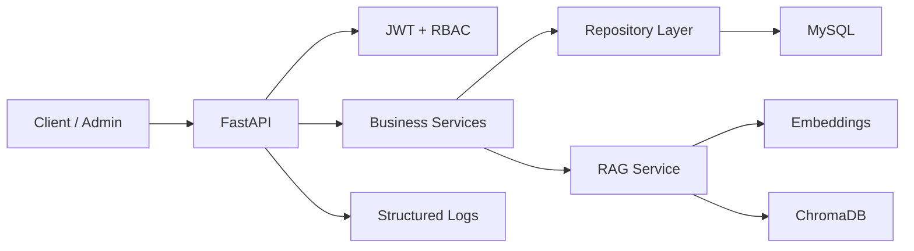

# HelixHR - AI-Driven Human Resources System

基于 FastAPI + MySQL + ChromaDB 的企业 HR 后端系统，覆盖员工、部门、薪资、角色权限和 HR 知识库问答。项目重点展示 Python 后端工程能力、RBAC 权限控制、JWT 认证、RAG 检索增强和 Docker 部署。

## 项目定位

企业 HR 制度文档分散，员工经常重复咨询请假、考勤、薪资、入职流程等问题。HelixHR 将传统 HR 管理 API 与 RAG 知识库结合，让管理员上传制度文档，员工通过自然语言查询，并返回可追溯的检索结果。

## 核心功能

- 员工管理：分页、筛选、排序、增删改查。
- 部门管理：支持部门层级结构。
- 薪资管理：月度薪资记录、查询和维护。
- RBAC 权限：管理员、HR、普通员工等角色隔离。
- JWT 认证：无状态认证与 token 过期控制。
- RAG 知识库：文档上传、自动切分、向量化、自然语言检索。
- 请求限流：基于 IP 的访问频率保护。
- 数据库迁移：Alembic 管理 schema 版本。
- Docker 部署：Dockerfile + docker-compose 一键启动。
- 测试覆盖：pytest 覆盖认证、员工和 RAG 核心接口。

## 技术栈

| 模块 | 技术 |
| --- | --- |
| Web 框架 | FastAPI |
| ORM | SQLAlchemy 2.x |
| 数据库 | MySQL 8 |
| 迁移 | Alembic |
| 认证 | JWT + bcrypt |
| 权限 | RBAC |
| RAG | sentence-transformers + ChromaDB |
| 配置 | YAML + ENV |
| 日志 | loguru |
| 测试 | pytest / pytest-asyncio / httpx |
| 部署 | Docker / docker-compose |

## 架构



## 快速开始

```bash
cp .env.example .env
pip install -r requirements.txt
python scripts/init_db.py
uvicorn app.main:app --reload --host 0.0.0.0 --port 8001
```

访问：

- Swagger: `http://localhost:8001/docs`
- ReDoc: `http://localhost:8001/redoc`
- Health: `http://localhost:8001/health`

## Docker 启动

```bash
docker compose up --build -d
```

## 主要接口

### 认证

| Method | Path | Description |
| --- | --- | --- |
| POST | `/api/v1/auth/login` | 登录 |
| POST | `/api/v1/auth/register` | 注册用户 |
| GET | `/api/v1/auth/me` | 当前用户信息 |

### 员工与组织

| Method | Path | Description |
| --- | --- | --- |
| GET | `/api/v1/employees` | 员工列表 |
| POST | `/api/v1/employees` | 新增员工 |
| GET | `/api/v1/departments` | 部门列表 |
| POST | `/api/v1/departments` | 新增部门 |

### RAG 知识库

| Method | Path | Description |
| --- | --- | --- |
| POST | `/api/v1/rag/documents/upload` | 上传制度文档 |
| POST | `/api/v1/rag/documents/text` | 提交文本内容 |
| POST | `/api/v1/rag/query` | 自然语言检索 |
| GET | `/api/v1/rag/documents` | 文档列表 |
| GET | `/api/v1/rag/stats` | 知识库统计 |

## RAG 落地价值

适合放入员工手册、考勤制度、请假制度、薪资说明和入职流程。系统通过文档切分、embedding 和向量检索返回相关内容，减少 HR 重复答疑成本。

建议评测方式：

- 准备 30 条 HR 常见问题。
- 记录 top-k 命中率、回答准确率和 bad case。
- 针对 bad case 调整 chunk size、top_k、关键词召回和文档结构。

## 测试

```bash
pytest tests/ -v
pytest tests/ --cov=app --cov-report=term-missing
```

## 项目结构

```text
.
├── app/
│   ├── api/             # API 路由
│   ├── core/            # 安全、异常、分页等基础模块
│   ├── db/              # 数据库会话
│   ├── models/          # SQLAlchemy 模型
│   ├── rag/             # RAG 检索模块
│   ├── repositories/    # 数据访问层
│   ├── schemas/         # Pydantic Schema
│   └── services/        # 业务服务层
├── alembic/             # 数据库迁移
├── scripts/             # 初始化和索引重建脚本
├── tests/               # 自动化测试
├── Dockerfile
└── docker-compose.yml
```

## 简历可讲亮点

- 使用分层架构拆分 API、Service、Repository，提升可维护性。
- RBAC + JWT 实现不同角色的接口权限隔离。
- 基于 ChromaDB 构建 HR 知识库检索能力，支持文档上传、切分、向量化和查询。
- 使用 Alembic 管理数据库版本，Docker Compose 编排 MySQL 和应用服务。
- 通过 pytest 覆盖认证、员工管理和 RAG 核心流程。
